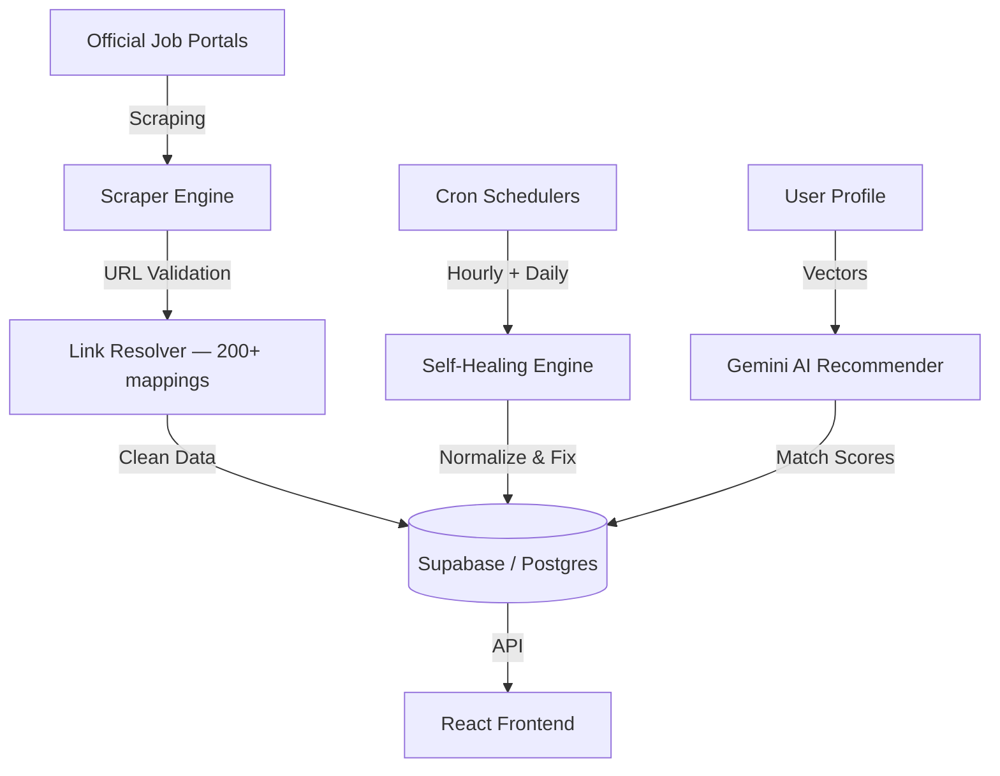

<p align="center">
  
</p>

<h1 align="center">SarkarHamariHai — सरकार हमारी है</h1>

<p align="center">
  <strong>India's smartest government job & exam aggregator.</strong><br/>
  Real data. Real official links.
</p>

<p align="center">
  🌐 <strong><a href="https://sarkarhamarihai.vercel.app">sarkarhamarihai</a></strong>
</p>

<p align="center">
  <a href="LICENSE"></a>
  <a href="https://react.dev/"></a>
  <a href="https://tailwindcss.com/"></a>
  <a href="https://deepmind.google/technologies/gemini/"></a>
  <a href="https://supabase.com/"></a>
  <a href="https://vercel.com/"></a>
</p>

---

## What is this?

SarkarHamariHai is a secure, high-performance aggregator for competitive exams and government careers across India (covering UPSC, SSC, Railways, Banking, Defense, Teaching, and State PSCs). It aggregates job notices from official sources, links directly to government domain portals, and provides baseline seed and template records for structured syllabus mapping, study tracking, and preparation scheduling.

---

## Core Product Features

### 1. Large-Scale Exam Catalog
- **17,000+ Database Records:** Houses a comprehensive catalog of competitive government exams categorized into canonical sectors. The dataset combines indexed/aggregated job listings, official recruitment notices (such as UPSC, SSC, and Railway notifications), and structured seed/template exam records.
- **Data Provenance & Domain Resolution:** Verified entries are mapped directly to official government portals (*.gov.in / *.nic.in), while baseline seed entries provide structured syllabus and preparation parameters across all 28 states and Union Territories.
- **On-the-Fly Category Correction:** Re-classifies tagging errors using smart regex overrides (e.g. correctly re-tagging State PSC civil service exams from UPSC, classifying Teaching/Police/Engineering/Healthcare/Judiciary based on title keywords).
- **Inferred Regional State Mapping:** Automatically extracts regional state identifiers from titles/organizations, overriding general "All India" tags on state-specific posts.

### 2. AI Recommendation System (Syllabus Compatibility Engine)
- **High-Fidelity Hybrid Matcher:** Scores syllabus overlaps using a multi-tiered pipeline: local keyword matching (20%), subject mapping (40%), semantic embedding vectors (30%), and category bonus (10%), enhanced by Gemini AI structural analysis.
- **Circuit Breaker System:** Prevents rate-limit lockouts by falling back to standard category blueprints (UPSC, SSC, Banking, Railways, etc.) during transient API or quota errors.
- **Granular Gap Analysis:** Computes matching/missing subjects, difficulty comparisons (Easier/Similar/Harder), and additional study time estimations.
- **Pre-Filtering Constraints:** Filters out highly technical roles (e.g., specific engineering or nursing posts) for candidates with general backgrounds.

### 3. Personal AI Master Roadmaps (PremiumRoadmapV9)
- **Phase-by-Phase Preparation Plans:** Generates structural study schedules divided into 4 preparation phases (Foundation, Core Mastery, Speed & Accuracy, and Final Polish).
- **Feasibility Assessment:** Analyzes remaining days, study hours, and academic credentials to classify preparation feasibility (Highly Feasible, Achievable, Challenging, or Risky).
- **Actionable Daily & Weekly Strategies:** Recommends morning/afternoon/evening schedules, spaced repetition cycles (Active Recall), mock test frequencies, and specific revision plans.

### 4. Zero-Placeholder Daily Study Planner & Scheduler
- **Subject-Level Resolution:** pre-populates daily planners with actual core subjects (e.g., *History*, *Geography*, *Quantitative Aptitude*) instead of generic dummy text placeholders (e.g., "Subject 1", "Subject 2").
- **Time-Slot Allocation:** Dynamically schedules study blocks based on sleep/wake hours and target study time inputs.
- **Evening AI Coach & Streaks:** Logs study logs, tracks consecutive streaks, and delivers motivational debriefs.

### 5. Automated Notification Hub & Live Tracking
- **Live Alerts:** In-app alerts warn candidates about upcoming deadlines, form openings, and status updates for saved and targeted exams.
- **Exam Target Reminders:** Sends alerts when notifications change or exams you have saved transition to live application status.

### 6. Official Domain Link Resolver
- **Ad & Clickbait Filter:** Scans and resolves links against over 200 legitimate state/central government domain patterns (e.g. `*.gov.in`, `*.nic.in`).
- **Direct Redirection:** Maps source links directly to verified PDF notifications, websites, and application portals.

### 7. Performance Optimized Data Transport (`/all-minimal`)
- **Lightweight Serializer:** Compresses massive dataset payloads by serializing data into index arrays, dropping JSON response sizes by ~49% for fast client-side loading and filtering.

### 8. Localized Multi-Language Interface
- Supports full translation maps across **11 major Indian languages**:
  - English, Hindi (हिन्दी), Tamil (தமிழ்), Telugu (తెలుగు), Bengali (বাংলা), Marathi (मराठी), Kannada (ಕನ್ನಡ), Malayalam (മലയാളം), Gujarati (ગુજરાતી), Punjabi (ਪੰਜਾਬੀ), and Odia (ଓଡ଼िଆ).

---

## Technical Architecture



---

## Technology Stack

- **Frontend** — React 19, Vite, Tailwind CSS v4, Framer Motion, Redux Toolkit
- **Backend** — Node.js (CommonJS), Express, Vercel Serverless Functions
- **Database** — PostgreSQL via Supabase DB Adapter (pg TCP pool with REST fallback)
- **AI Core** — Google GenAI SDK (`@google/genai` Gemini 2.5), NVIDIA LLaMA 3.1 8B Fallback
- **Scheduling** — Cron-Job.org / Vercel Serverless Crons

---

## Directory Structure

```
├── api/              Vercel serverless endpoints + cron handlers
├── backend/
│   ├── src/
│   │   ├── engines/  Link resolver, data healer, eligibility engine, sync core, verification engine
│   │   ├── routes/   Express API routes (tracker, auth, jobs, syllabus, apply, roadmap, verifier, audit)
│   │   ├── services/ Gemini AI, translation helper, database config, recommender service
│   │   └── scrapers/ UPSC, SSC scrapers extending base classes
│   └── scripts/      Database maintenance utilities
├── src/
│   ├── components/   React UI modules & Tracker views
│   ├── pages/        Dashboard, LoginPage, TrackerPage, and details routes
│   ├── store/        Redux slices (auth, UI states)
│   ├── i18n/         Multi-language dictionary and context providers
│   └── utils/        Supabase wrappers, translation converters
├── scripts/          Verification, healer, and audit scripts
├── supabase/         PostgreSQL schema, indices, and database migrations
└── public/           Assets and logo resources
```

---

## Getting Started

### 1. Installation
Clone the repository and install the project dependencies:
```bash
git clone https://github.com/aayushverma246-ai/sarkarhamarihai.git
cd sarkarhamarihai
npm install
```

### 2. Environment Variables
Create a local environment file:
```bash
cp .env.example .env
```
Provide the required configurations in `.env`:
- **Supabase credentials** (URL, anon key, service role key, DB password)
- **JWT secrets**
- **Gemini API key** (`GEMINI_API_KEY_NEW`)

### 3. Database Initialization
Seed the databases with initial mock exams and schemas:
```bash
npm run seed
```

### 4. Running Development Servers
Spin up both the Vite client server and Node Express backend server in parallel:
```bash
npm run dev
```
- Frontend client runs at `http://localhost:5173`
- Backend API runs at `http://localhost:3001`

### 5. Running Code & Data Auditing
Perform a comprehensive integrity and structure audit against all active database records:
```bash
npm run migrate
```

---

## Contributing

1. Fork this repository.
2. Create a specific feature branch (`git checkout -b my-feature`).
3. Commit your changes.
4. Push the branch and open a Pull Request.

---

## License

This project is licensed under the MIT License — see the [LICENSE](LICENSE) file for details.
